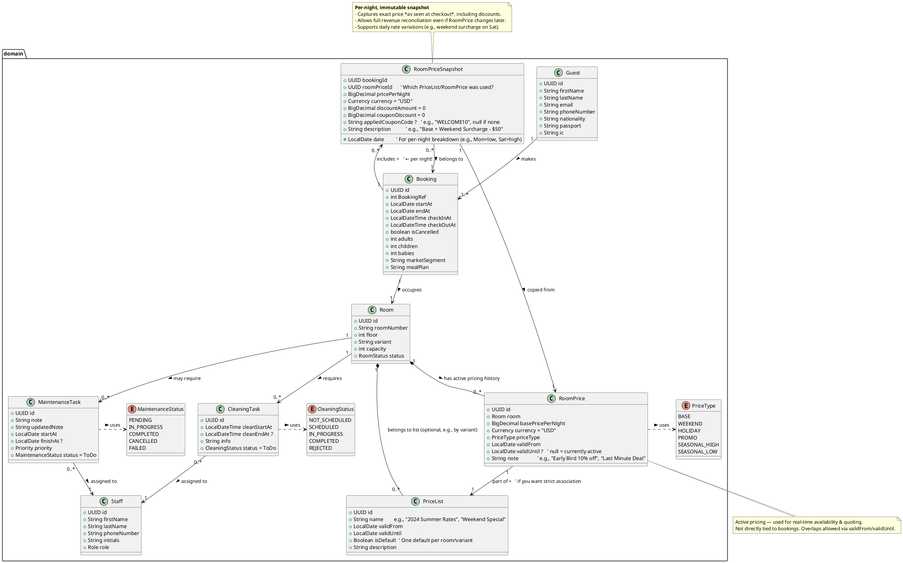

# DCD

## Domain

✅ MaintenanceStatus and CleaningStatus as dedicated enum classes  
✅ Clear association from tasks to their status enums  
✅ Realistic status values (e.g., PENDING, IN_PROGRESS, COMPLETED, CANCELLED)  
✅ Embedded in the domain package for consistency  
✅ PriceList — immutable catalog of base prices & rules  
✅ RoomPriceSnapshot — concrete price applied for a specific booking (captures time-of-booking rate, discounts, coupons)  
✅ Keeps RoomPrice as active pricing (for UI / current availability), but not used directly in bookings  

💡 Example Flow:
1.  Admin creates a PriceList named "Summer 2024"
1.  Adds RoomPrices (e.g., Standard Room: $150, Suite: $300)
1.  Guest books → system copies relevant RoomPrice entries into RoomPriceSnapshot per night
1.  If guest applies "WELCOME10" coupon → couponDiscount = 15, appliedCouponCode = "WELCOME10"
1.  Later, RoomPrice changes to $160 — but booking stays accurate with snapshot.

## Application

## Infrastructure

## Web

## API
