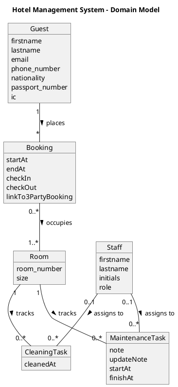

# Domain Model

## Description

This is a domain model for a hotel management system. It includes the main entities involved in the system, such as guests, bookings, rooms, cleaning tasks, maintenance tasks, and staff members. The relationships between these entities are also defined to illustrate how they interact with each other.

## Model

## Remarks

As we are using auditlogging, we do not need to store the history of the tasks. The `updateNote` attribute in the `MaintenanceTask` entity is used to store any updates or changes made to the maintenance task.
