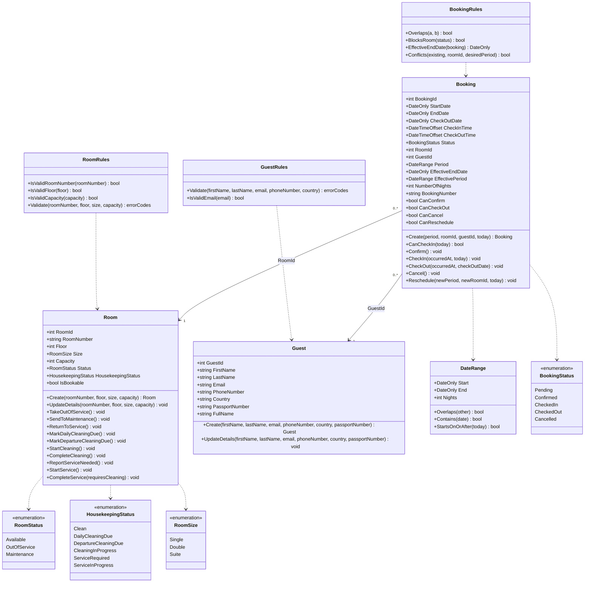
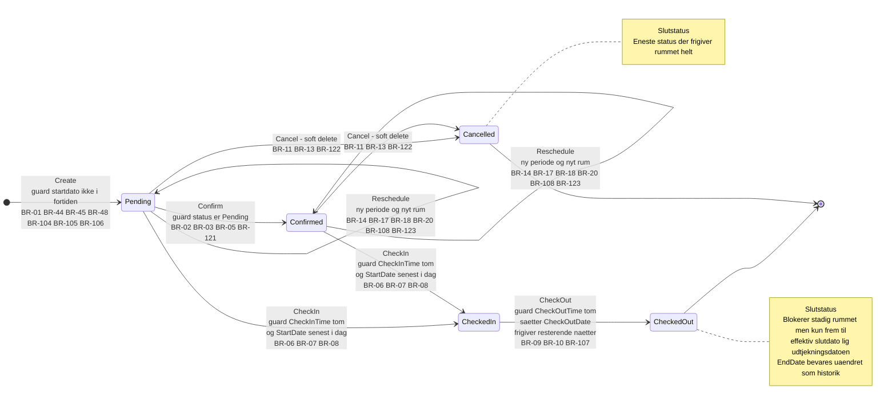
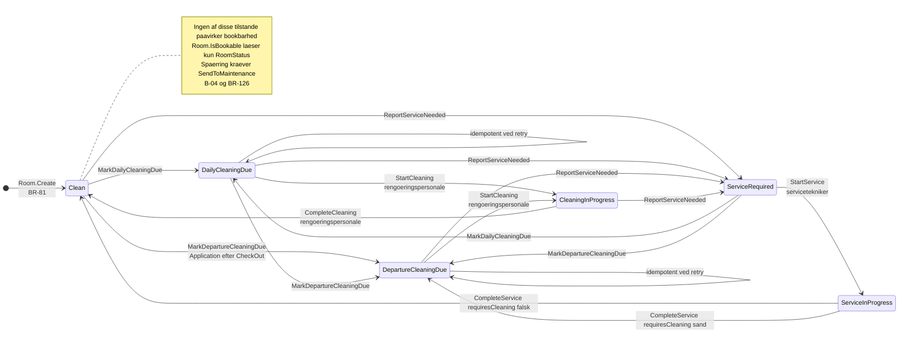
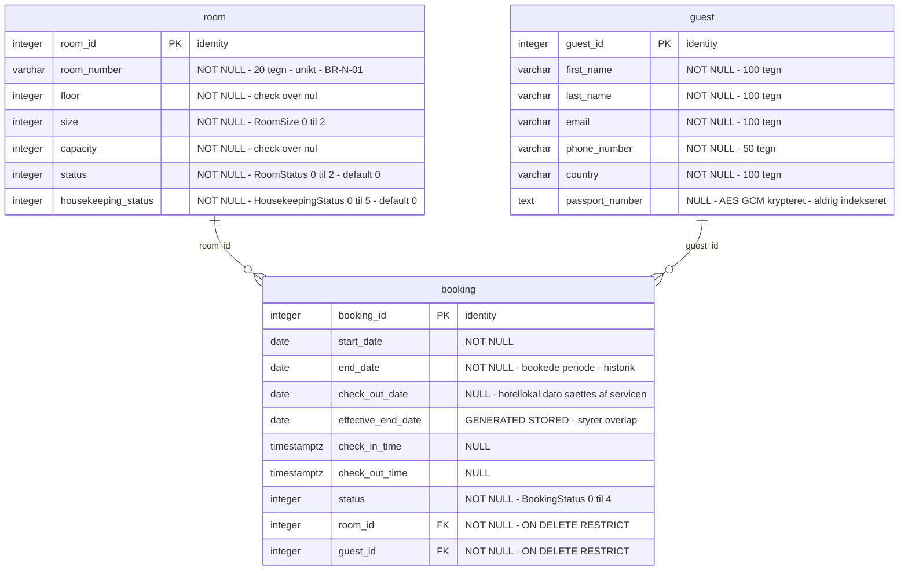
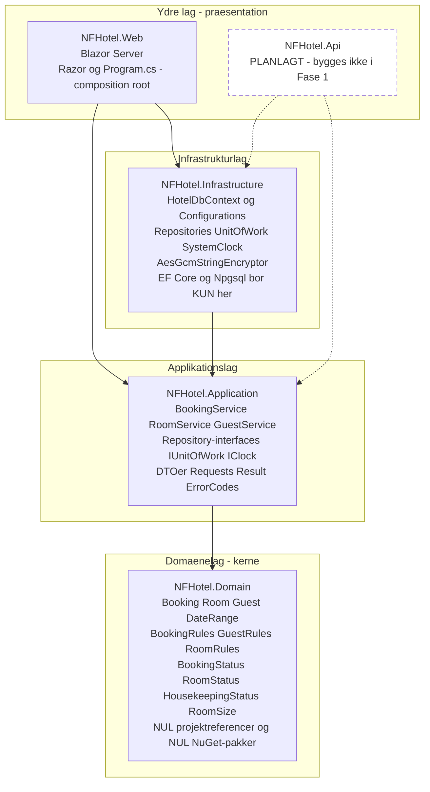

# Architecture-Diagrams.md — Fase 1

> Bilag til `Architecture.md`. Tegnet af `design:diagrams` ud fra domæne- og lagdesignet.
> Diagrammerne følger den **reviderede** overlapsregel (A-01) og afgørelserne A-06 og A-07.
>
> **Gældende overlapsregel:** en booking blokerer rummet fra `StartDate` til sin effektive slutdato, medmindre den er `Cancelled`.
> `EffectiveEndDate = GREATEST(StartDate + 1 dag, COALESCE(CheckOutDate, EndDate))`. `EndDate` ændres aldrig.

---

## 1. Domænemodel

Tre aggregatrødder uden navigerbar sammenhæng ud over fremmednøglerne. `DateRange` persisteres ikke — den er regelsted og parametertype. `CheckInTime`, `CheckOutTime`, `CheckOutDate` og `PassportNumber` er nullable; mermaid gengiver ikke `?`. Validerings­metoderne returnerer fejlkoder, ikke tekst (A-09).

---

## 2. Tilstandsdiagram — BookingStatus

`Confirmed` er ikke en forudsætning for check-in (B-01) — derfor to `CheckIn`-kanter. `Reschedule` er en selvovergang. Den reviderede regel rammer kun `CheckOut`: overgangen ændrer ikke *om* bookingen blokerer, men flytter den effektive slutdato ned til udtjekningsdatoen.

---

## 3. Tilstandsdiagram — HousekeepingStatus

Tre spor: daglig rengøring, slutrengøring efter afrejse, og service — de to første deler `CleaningInProgress`. `MarkDepartureCleaningDue` udløses af Application efter `Booking.CheckOut`, ikke af `Booking` selv (to aggregater).

**Rollerne er dokumentation, ikke håndhævelse i Fase 1 (A-12).** Autorisation er udskudt; enhver kan i praksis kalde enhver overgang indtil Identity bygges. Intet inspektionstrin — tilføjes som `Inspected` når mobil-guilden beder om det.

---

## 4. ER-diagram

Alle tre tabeller bærer desuden systemkolonnen `xmin` som optimistisk samtidighedstoken. Exclusion constraint, check constraints og indekser står i `Architecture.md` afsnit 5.

---

## 5. Lag- og pakkediagram

Beviset ligger i kantlisten: fire byggede kanter, hver fra et ydre lag mod kernen. `Domain` har **udgrad nul**. `Application` har præcis én udgående kant. `Infrastructure` peger på `Application`, aldrig omvendt — derfor bor repository-*interfaces* i Application og *implementeringerne* i Infrastructure.

Reglen der ikke kan tegnes — at `Application` ikke må referere EF Core eller Npgsql — håndhæves af arkitekturtesten.

---

## 6. Use case-diagram

```mermaid
flowchart LR
    Personale(["Personale<br/>eneste aktoer i Fase 1"])
    Kunde(["Kunde - UDSKUDT"])
    Mobil(["Rengoering og service via mobil - UDSKUDT"])

    subgraph UCB [IBookingService - 9]
        B1["GetByIdAsync"]
        B2["GetOverviewAsync<br/>BR-23 BR-24 BR-25 BR-32"]
        B3["GetAvailableRoomsAsync<br/>BR-34 BR-36 BR-39 BR-40 BR-110"]
        B4["CreateAsync<br/>BR-01 BR-41 til BR-49"]
        B5["ConfirmAsync<br/>BR-02 BR-03 BR-05"]
        B6["CheckInAsync<br/>BR-06 BR-07 BR-08"]
        B7["CheckOutAsync<br/>BR-09 BR-10 - saetter CheckOutDate"]
        B8["CancelAsync<br/>BR-11 BR-13"]
        B9["RescheduleAsync<br/>BR-14 BR-17 til BR-20"]
    end

    subgraph UCR [IRoomService - 15]
        R1["GetByIdAsync"]
        R2["GetAllAsync"]
        R3["SearchAsync<br/>BR-74 BR-76"]
        R4["GetFilterOptionsAsync<br/>BR-75"]
        R5["CreateAsync<br/>BR-97 til BR-100 BR-113"]
        R6["UpdateAsync<br/>BR-82 - uden status"]
        R7["DeleteAsync<br/>BR-78 BR-112"]
        R8["TakeOutOfServiceAsync"]
        R9["SendToMaintenanceAsync"]
        R10["ReturnToServiceAsync"]
        R11["MarkDailyCleaningDueAsync"]
        R12["MarkDepartureCleaningDueAsync"]
        R13["StartCleaningAsync"]
        R14["CompleteCleaningAsync"]
        R15["ReportServiceNeededAsync<br/>StartServiceAsync CompleteServiceAsync"]
    end

    subgraph UCG [IGuestService - 6]
        G1["GetByIdAsync<br/>BR-35"]
        G2["SearchAsync<br/>BR-68 BR-69 BR-70"]
        G3["CreateAsync<br/>BR-52 til BR-57 BR-91 til BR-96"]
        G4["UpdateAsync<br/>BR-62 BR-66 BR-72"]
        G5["DeleteAsync<br/>BR-N-02 kraever godkendelse"]
        G6["ValidateFields<br/>BR-58 BR-59 - synkron"]
    end

    subgraph UCX [Udskudt - tegnes men bygges ikke]
        X1["Selvbetjent booking og betaling<br/>ingen pris i domaenet"]
        X2["ISalesService<br/>UDELADT - BR-31 giver altid nul"]
        X3["Mobil-API for rengoering og service<br/>fladen er R11 til R15"]
    end

    Personale --> UCB
    Personale --> UCR
    Personale --> UCG
    Kunde -.-> X1
    Personale -.-> X2
    Mobil -.-> X3
    X3 -.-> UCR

    classDef deferred stroke-dasharray: 6 4,fill:#ffffff;
    class Kunde,Mobil,X1,X2,X3,UCX deferred;
```

Ét use case = én service-metode: **30 byggede use cases**. `IRoomService` voksede fra 9 til 15, fordi rengøringsovergangene fik hver sin metode i stedet for én generisk mål-status (A-07).

De syv rengøringsmetoder bygges nu som backoffice-funktioner. De er samtidig præcis den flade mobilappen senere skal kalde — derfor den stiplede pil fra `X3`.
