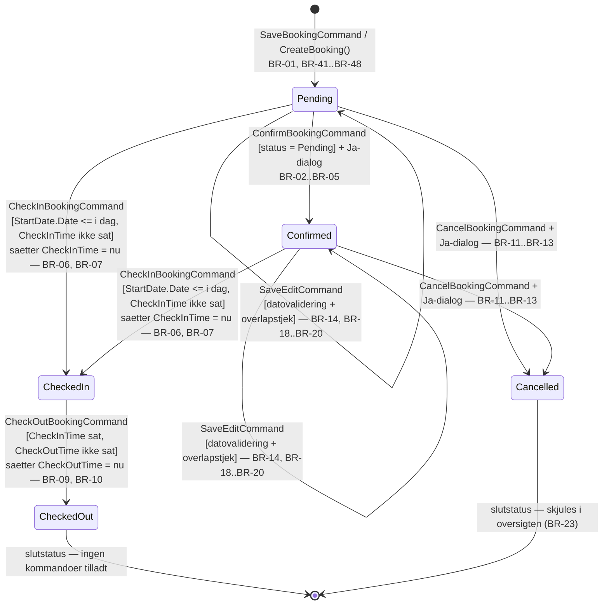

# Business Rules Ledger — NFHotel

> Fase 0, genereret 2026-09-02. Kilde: `4. Semester\NFHotel-Hotel-main\`.
> **126 regler.** Kolonnen "Status i ny kode" udfyldes i Fase 3 af `verify:ledger-audit`.
> Kolonnen "Bevis" peger på den test i det gamle projekt der beviser reglen (T-id'er, se `Analysis.md` afsnit 5).
>
> Grupper: BR-01–BR-90 fra ViewModels · BR-91–BR-109 modelvalidering · BR-110–BR-116 repo-lag · BR-117–BR-126 views/converters.

| Id | Regel | Kilde (fil:linje) | Type | Bevis | Status i ny kode |
|---|---|---|---|---|---|
| BR-01 | En booking oprettes altid med status `Pending` — der findes ingen anden startstatus. | `ViewModels/NewBookingViewModel.cs:319` | statusovergang | | |
| BR-02 | Bookingen kan kun bekræftes (`Pending → Confirmed`) når en booking er valgt og dens status er præcis `Pending`; ellers er `ConfirmBookingCommand` deaktiveret. | `ViewModels/BookingOverviewViewModel.cs:473-479` | statusovergang | T-20, T-27 | |
| BR-03 | Ved bekræftelse gentjekkes BR-02 i selve handlingen og afvises med "Cannot confirm this booking - only Pending bookings can be confirmed". | `ViewModels/BookingOverviewViewModel.cs:488-497` | statusovergang | | |
| BR-04 | Bekræftelse kræver eksplicit brugerbekræftelse (Ja/Nej-dialog); alt andet end "Yes" afbryder uden ændring. | `ViewModels/BookingOverviewViewModel.cs:499-511` | adgang | | |
| BR-05 | Bekræftelse sætter `Status = Confirmed`, persisterer via repository og genindlæser al data. | `ViewModels/BookingOverviewViewModel.cs:522-525` | statusovergang | | |
| BR-06 | Check-in er kun tilladt når status er `Pending` ELLER `Confirmed`, OG `StartDate.Date <= i dag`, OG `CheckInTime` ikke allerede er sat. | `ViewModels/BookingOverviewViewModel.cs:552-562` | statusovergang | T-21, T-22, T-23 | |
| BR-07 | Check-in sætter `CheckInTime = DateTime.Now` (aktuelt klokkeslæt) og `Status = CheckedIn`, og persisterer. | `ViewModels/BookingOverviewViewModel.cs:584-588` | statusovergang | | |
| BR-08 | Check-in-reglen gentjekkes i handlingen og afvises med "Cannot check in this booking"; check-in kræver ingen bekræftelsesdialog. | `ViewModels/BookingOverviewViewModel.cs:570-579` | statusovergang | | |
| BR-09 | Check-ud er kun tilladt når status er præcis `CheckedIn`, OG `CheckInTime` har værdi, OG `CheckOutTime` endnu ikke har værdi. | `ViewModels/BookingOverviewViewModel.cs:601-609` | statusovergang | T-24 | |
| BR-10 | Check-ud sætter `CheckOutTime = DateTime.Now` og `Status = CheckedOut`, og persisterer; ingen bekræftelsesdialog. | `ViewModels/BookingOverviewViewModel.cs:617-635` | statusovergang | | |
| BR-11 | Annullering er kun tilladt når status er `Pending` ELLER `Confirmed` — en `CheckedIn`/`CheckedOut` booking kan ikke annulleres. | `ViewModels/BookingOverviewViewModel.cs:648-655` | statusovergang | T-25 | |
| BR-12 | Annullering kræver eksplicit "Yes" i dialogen "Cancel Booking Permanently From System?"; ellers sker intet. | `ViewModels/BookingOverviewViewModel.cs:674-682` | adgang | | |
| BR-13 | Annullering er soft-delete: `Status = Cancelled` gemmes, rækken slettes aldrig fysisk. | `ViewModels/BookingOverviewViewModel.cs:687-690` | statusovergang | | |
| BR-14 | Redigering af en booking er kun tilladt når status er `Pending` ELLER `Confirmed`. | `ViewModels/BookingOverviewViewModel.cs:715-722` | adgang | T-26 | |
| BR-15 | Ved indgang til redigeringstilstand forudfyldes edit-felterne med bookingens nuværende rum (`AllRooms` matchet på `RoomId == SelectedBooking.RoomID`), `StartDate` og `EndDate`, og `IsEditMode` sættes true. | `ViewModels/BookingOverviewViewModel.cs:725-735` | beregning | | |
| BR-16 | `SaveEdit` og `CancelEdit` kan kun udføres når `IsEditMode` er true. | `ViewModels/BookingOverviewViewModel.cs:261-269` | adgang | | |
| BR-17 | Ved gem af redigering gentjekkes statuskravet (BR-14) og afvises med "Cannot edit this booking - only Pending or Confirmed bookings can be edited". | `ViewModels/BookingOverviewViewModel.cs:743-752` | statusovergang | | |
| BR-18 | Ved gem af redigering køres `Booking.ValidateEdit(nyStart, nySlut)`; enhver fejl vises samlet (linjeskilt) og blokerer gemning. | `ViewModels/BookingOverviewViewModel.cs:755-765` | validering | T-08 | |
| BR-19 | Ved gem af redigering afvises ændringen hvis der findes en anden booking (`BookingID != nuværende`) på samme rum, hvis status hverken er `Cancelled` eller `CheckedOut`, og hvor `andenStart < nytUdtjek` OG `andenSlut > nytIndtjek` (halvåben overlap-test) — "Room is not available for selected dates". | `ViewModels/BookingOverviewViewModel.cs:768-786` | validering | | |
| BR-20 | Består alle tjek, opdateres `StartDate`, `EndDate` og `RoomID`, bookingen persisteres, `IsEditMode` sættes false og data genindlæses. | `ViewModels/BookingOverviewViewModel.cs:791-798` | beregning | | |
| BR-21 | `CancelEdit` forlader redigeringstilstanden uden at gemme — de indtastede edit-værdier kasseres. | `ViewModels/BookingOverviewViewModel.cs:819-822` | statusovergang | | |
| BR-22 | Når en booking vælges, genberegnes tilladeligheden af Confirm, CheckIn, CheckOut, Cancel og Edit. | `ViewModels/BookingOverviewViewModel.cs:56-65` | adgang | | |
| BR-23 | Annullerede bookinger vises aldrig i oversigten, uanset visningsperiode. | `ViewModels/BookingOverviewViewModel.cs:394-402` | beregning | T-28 | |
| BR-24 | I årsvisning vises kun bookinger der overlapper 1. januar–31. december i det viste år (`StartDate <= 31/12` OG `EndDate >= 1/1`). | `ViewModels/BookingOverviewViewModel.cs:389-398` | beregning | | |
| BR-25 | En booking matcher en søgetekst hvis den (case-insensitivt) indeholdes i "Fornavn Efternavn", land, e-mail eller værelsesnummer; bookinger uden gæst eller rum matcher aldrig. | `ViewModels/BookingOverviewViewModel.cs:370-378` | beregning | T-29 | |
| BR-26 | Så snart søgefeltet indeholder andet end whitespace, skiftes visningsperioden automatisk til "Year". | `ViewModels/BookingOverviewViewModel.cs:75-78` | beregning | | |
| BR-27 | Visningens startdato er ugens start (`CurrentMonth` minus dage siden ugens første dag) i ugevisning, ellers den 1. i den viste måned. | `ViewModels/BookingOverviewViewModel.cs:38-51` | beregning | | |
| BR-28 | Frem/tilbage-navigation flytter ±7 dage i ugevisning, ±1 år i årsvisning og ±1 måned ellers. | `ViewModels/BookingOverviewViewModel.cs:322-337` | beregning | | |
| BR-29 | Kolonneantallet i kalenderen er 7 (uge), det faktiske antal dage i måneden (måned) eller 12 (år). | `ViewModels/BookingOverviewViewModel.cs:339-368` | beregning | | |
| BR-30 | Periodeoverskriften vises som "Week {ugenr}, {år}" (ugenummer efter aktuel kulturs ugeregel), "{år}" eller "MMMM yyyy". | `ViewModels/BookingOverviewViewModel.cs:112-134` | beregning | | |
| BR-31 | Månedens omsætning sættes altid til 0 — der findes ingen faktisk omsætningsberegning. | `ViewModels/BookingOverviewViewModel.cs:415-418` | beregning | | |
| BR-32 | Sortering: klik på samme kolonne igen vender retningen, klik på ny kolonne sorterer stigende; tomt kolonnenavn gør intet. | `ViewModels/BookingOverviewViewModel.cs:430-454` | beregning | | |
| BR-33 | Efter lukning af "Ny booking"-dialogen genindlæses hele bookingoversigten. | `ViewModels/BookingOverviewViewModel.cs:423-428` | beregning | | |
| BR-34 | Rumlisten i ny booking indeholder kun rum som repositoriet anser for tilgængelige (`GetAllByAvailability`). | `ViewModels/NewBookingViewModel.cs:158-167` | beregning | T-37 | |
| BR-35 | Er en gæst valgt på forhånd, forudfyldes formularen med gæstens GuestID, navn, e-mail, telefon, land og pasnummer. | `ViewModels/NewBookingViewModel.cs:169-173, 240-249` | beregning | T-30 | |
| BR-36 | Ændres enten ind- eller udtjekningsdato, genberegnes den tilgængelige rumliste øjeblikkeligt. | `ViewModels/NewBookingViewModel.cs:42-62` | beregning | | |
| BR-37 | Mangler en af de to datoer, vises hele listen af tilgængelige rum og fejlbeskeden ryddes. | `ViewModels/NewBookingViewModel.cs:183-188` | validering | | |
| BR-38 | Er udtjekningsdato ≤ indtjekningsdato, tømmes rumlisten og "Check-out date must be after check-in date" vises (0 nætter er ikke tilladt). | `ViewModels/NewBookingViewModel.cs:191-196` | validering | T-31 | |
| BR-39 | Et rum er optaget i perioden hvis der findes en ikke-annulleret booking med `StartDate < ønsketUdtjek` OG `EndDate > ønsketIndtjek`; sådanne rum fjernes fra listen (afrejse- og ankomstdag samme dag er tilladt). | `ViewModels/NewBookingViewModel.cs:204-217` | validering | | |
| BR-40 | Er der nul ledige rum i perioden, vises "No rooms available for the selected period. Please try different dates."; ellers ryddes fejlbeskeden. | `ViewModels/NewBookingViewModel.cs:227-234` | validering | | |
| BR-41 | Oprettelse af booking kræver at indtjekningsdato er udfyldt ("Check-in date is required"). | `ViewModels/NewBookingViewModel.cs:261-264` | validering | T-01 | |
| BR-42 | Oprettelse af booking kræver at udtjekningsdato er udfyldt ("Check-out date is required"). | `ViewModels/NewBookingViewModel.cs:266-269` | validering | T-02 | |
| BR-43 | Oprettelse af booking kræver udtjekning > indtjekning (mindst 1 nat). | `ViewModels/NewBookingViewModel.cs:271-274` | validering | T-03 | |
| BR-44 | Indtjekningsdatoen må ikke ligge før dags dato (datodel sammenlignet, samme dag tilladt) — "Check-in date cannot be in the past". | `ViewModels/NewBookingViewModel.cs:276-279` | validering | T-04 | |
| BR-45 | Der skal være valgt et rum — "Please select a room". | `ViewModels/NewBookingViewModel.cs:282-285` | validering | T-05 | |
| BR-46 | Gæsteoplysningerne valideres via `Guest.Validate()`; kun den FØRSTE fejl vises til brugeren og oprettelsen afbrydes. | `ViewModels/NewBookingViewModel.cs:288-304` | validering | | |
| BR-47 | En gæst med `GuestID == 0` betragtes som ny og oprettes i databasen før bookingen, hvorefter det tildelte id bruges; en eksisterende gæst genbruges uændret. | `ViewModels/NewBookingViewModel.cs:306-312` | beregning | | |
| BR-48 | Bookingen gemmes med de valgte datoer, det valgte rums `RoomId`, gæstens id og status `Pending`. | `ViewModels/NewBookingViewModel.cs:314-328` | statusovergang | | |
| BR-49 | Ved succes vises bookingnummer, gæstens navn og antal nætter (`Booking.NumberOfNights`) i kvitteringsteksten. | `ViewModels/NewBookingViewModel.cs:331` | beregning | T-09, T-10 | |
| BR-50 | Bookingvinduet lukkes automatisk 2000 ms efter en vellykket oprettelse. | `ViewModels/NewBookingViewModel.cs:334-340` | beregning | | |
| BR-51 | Enhver `ArgumentException` fra valideringen vises som fejltekst; øvrige fejl som "An unexpected error occurred: …" — der oprettes ingen booking i begge tilfælde. | `ViewModels/NewBookingViewModel.cs:342-349` | validering | | |
| BR-52 | Gæstens fornavn er påkrævet ("First name is required."). | `ViewModels/NewGuestViewModel.cs:177-180` | validering | T-11, T-12 | |
| BR-53 | Gæstens efternavn er påkrævet ("Last name is required."). | `ViewModels/NewGuestViewModel.cs:181-184` | validering | T-11 | |
| BR-54 | Gæstens telefonnummer er påkrævet ("Phone number is required.") — intet formatkrav. | `ViewModels/NewGuestViewModel.cs:185-188` | validering | T-11 | |
| BR-55 | Gæstens e-mail er påkrævet og skal indeholde både "@" og "." ("A valid email is required.") — ingen regex. | `ViewModels/NewGuestViewModel.cs:189-193` | validering | T-13 | |
| BR-56 | Gæstens land er påkrævet ("Country is required."). | `ViewModels/NewGuestViewModel.cs:194-197` | validering | T-11 | |
| BR-57 | Pasnummer valideres ikke og er dermed valgfrit. | `ViewModels/NewGuestViewModel.cs:69-77` | validering | T-14 | |
| BR-58 | Gem-knappen er kun aktiv når alle fem fejlbeskeder (fornavn, efternavn, telefon, e-mail, land) er tomme. | `ViewModels/NewGuestViewModel.cs:155, 199-207` | adgang | | |
| BR-59 | Alle felter revalideres ved hver ændring og ved åbning af formularen (null normaliseres til tom streng). | `ViewModels/NewGuestViewModel.cs:20-67, 157-158, 168-175` | validering | | |
| BR-60 | Ved gem valideres gæsten igen med `Guest.Validate()`; ALLE fejl vises samlet og gemning afbrydes. | `ViewModels/NewGuestViewModel.cs:209-220` | validering | T-15 | |
| BR-61 | Gemning kræver eksplicit "Yes" på "Are you sure you want to save the changes?"; manglende dialog-handler tolkes som "No". | `ViewModels/NewGuestViewModel.cs:222-224` | adgang | | |
| BR-62 | I redigeringstilstand bevares gæstens oprindelige `GuestID` og der kaldes `UpdateGuest`; ellers oprettes ny gæst og det tildelte id sættes på objektet. | `ViewModels/NewGuestViewModel.cs:211-213, 226-229` | beregning | | |
| BR-63 | Formularens titel/knaptekst er "Edit Guest"/"Save" i redigeringstilstand og "New Guest"/"Create" ved oprettelse. | `ViewModels/NewGuestViewModel.cs:141-142` | beregning | | |
| BR-64 | Annuller lukker formularen uden at gemme. | `ViewModels/NewGuestViewModel.cs:236-239` | statusovergang | | |
| BR-65 | Rediger-gæst og "opret booking for gæst" er kun mulige når en gæst er valgt. | `ViewModels/GuestOverviewViewModel.cs:106-108` | adgang | | |
| BR-66 | Redigering sker altid på en KOPI af gæsten (fornavn, efternavn, e-mail, telefon, land, pasnummer) — originalen ændres ikke direkte. | `ViewModels/GuestOverviewViewModel.cs:166-183` | adgang | | |
| BR-67 | Forsøg på redigering uden valgt gæst viser "You must select a guest to edit." og afbryder. | `ViewModels/GuestOverviewViewModel.cs:168-172` | adgang | | |
| BR-68 | Gæstesøgning: søgeteksten deles i ord på mellemrum, og ALLE ord skal (case-insensitivt) findes i enten fuldt navn, land eller e-mail (AND-logik). | `ViewModels/GuestOverviewViewModel.cs:146-157` | beregning | T-40 | |
| BR-69 | Gæstelisten sorteres altid alfabetisk efter "fornavn efternavn" i små bogstaver. | `ViewModels/GuestOverviewViewModel.cs:129-143, 220-227` | beregning | | |
| BR-70 | Tom eller whitespace-søgning viser alle gæster. | `ViewModels/GuestOverviewViewModel.cs:131-135` | beregning | | |
| BR-71 | "Ryd gæst" erstatter den valgte gæst med et tomt `Guest`-objekt og slår både redigerings- og ny-gæst-tilstand fra. | `ViewModels/GuestOverviewViewModel.cs:186-191` | statusovergang | | |
| BR-72 | Opdatering af den valgte gæst overskriver præcis seks felter — `GuestID` ændres aldrig. | `ViewModels/GuestOverviewViewModel.cs:208-218` | beregning | | |
| BR-73 | Booking-for-gæst-hændelsen udløses kun når en gæst faktisk er valgt (dobbelttjek ud over BR-65). | `ViewModels/GuestOverviewViewModel.cs:193-199` | adgang | | |
| BR-74 | Rumfiltret kombinerer etage, rumstørrelse og status; tom/whitespace rumstørrelse tolkes som "intet filter" (null). | `ViewModels/RoomOverviewViewModel.cs:146-159` | beregning | T-38, T-39 | |
| BR-75 | Filtervalgmulighederne udledes af de eksisterende rum som distinkte, sorterede værdier for etage, rumstørrelse og status. | `ViewModels/RoomOverviewViewModel.cs:128-144` | beregning | | |
| BR-76 | "Ryd filter" nulstiller etage, rumstørrelse og status til null og genindlæser samtlige rum. | `ViewModels/RoomOverviewViewModel.cs:161-168` | beregning | | |
| BR-77 | Sletning af et rum kræver eksplicit "Yes" på advarslen "…This can disrupt logged bookings". | `ViewModels/RoomOverviewViewModel.cs:196-203` | adgang | | |
| BR-78 | Kaster repositoriet `InvalidOperationException` ved sletning (fx rum med bookinger), forbliver rummet i listen og fejlteksten vises som "Unable to delete room". | `ViewModels/RoomOverviewViewModel.cs:205-214` | validering | | |
| BR-79 | Rediger-rum gør intet hvis der ikke er sendt et rum med (null-parameter). | `ViewModels/RoomOverviewViewModel.cs:181-183, 196-198` | adgang | | |
| BR-80 | Efter et gemt rum genindlæses både rumlisten og filtervalgmulighederne, og sidepanelet lukkes. | `ViewModels/RoomOverviewViewModel.cs:217-228` | beregning | | |
| BR-81 | Et nyoprettet rum får som udgangspunkt status `Available`. | `ViewModels/FormsViewModel/RoomFormViewModel.cs:35-43` | statusovergang | T-19 | |
| BR-82 | Rum med `RoomId == 0` oprettes; alle andre opdateres. | `ViewModels/FormsViewModel/RoomFormViewModel.cs:59-66` | beregning | | |
| BR-83 | Rumformularens titel/knaptekst er "Create Room"/"Create" ved oprettelse og "Edit Room"/"Save" ved redigering. | `ViewModels/FormsViewModel/RoomFormViewModel.cs:35-49` | beregning | | |
| BR-84 | `Room.Validate()` kaldes ved gem, men resultatet ignoreres — ugyldige rum gemmes alligevel (fanges først af BR-113 i repo-laget). | `ViewModels/FormsViewModel/RoomFormViewModel.cs:58` | validering | | |
| BR-85 | Applikationen starter altid på bookingoversigten. | `ViewModels/MainViewModel.cs:47` | adgang | | |
| BR-86 | Navigation mellem booking-, gæste-, rum-, salgs- og gæstepolitikvisning er altid tilladt, og hver visning holder én levetidslang instans. | `ViewModels/MainViewModel.cs:42-72` | adgang | | |
| BR-87 | En kommando uden eksplicit `canExecute` er altid tilladt. | `Commands/RelayCommand.cs:28-31` | adgang | | |
| BR-88 | `DateGreaterThan`-validering fejler når den validerede dato er ≤ sammenligningsdatoen, med "{felt} must be after {sammenligningsfelt}". | `Validation/DateGreaterThanAttribute.cs:34-43` | validering | | |
| BR-89 | Peger `DateGreaterThan` på et ikke-eksisterende felt, fejler valideringen med "Unknown property: {navn}". | `Validation/DateGreaterThanAttribute.cs:23-28` | validering | | |
| BR-90 | Er enten værdien eller sammenligningsværdien ikke en `DateTime` (fx null), betragtes valideringen som bestået. | `Validation/DateGreaterThanAttribute.cs:34-46` | validering | | |
| BR-91 | `Guest.FirstName` må ikke være null, tom eller kun whitespace. | `Models/Guest.cs:49-50` | validering | T-11, T-12 | |
| BR-92 | `Guest.LastName` må ikke være null, tom eller kun whitespace. | `Models/Guest.cs:51-52` | validering | T-11 | |
| BR-93 | `Guest.Email` skal være udfyldt og indeholde både `@` og `.` (positionen kontrolleres ikke). | `Models/Guest.cs:53-54` | validering | T-13 | |
| BR-94 | `Guest.PhoneNumber` må ikke være tom (intet formatkrav). | `Models/Guest.cs:55-56` | validering | T-11 | |
| BR-95 | `Guest.Country` må ikke være tom. | `Models/Guest.cs:57-58` | validering | T-11 | |
| BR-96 | `Guest.Validate()` samler alle fejl i én liste i stedet for at fejle på den første. | `Models/Guest.cs:39-58` | validering | T-15 | |
| BR-97 | `Room.RoomNumber` må ikke være tom eller whitespace. | `Models/Room.cs:40-41` | validering | T-16 | |
| BR-98 | `Room.Floor` skal være > 0 (stueetage og kælder er dermed ikke tilladt). | `Models/Room.cs:43-44` | validering | T-17 | |
| BR-99 | `Room.RoomSize` må ikke være tom — men der kontrolleres ikke mod et sæt tilladte værdier. | `Models/Room.cs:46-47` | validering | T-16 | |
| BR-100 | `Room.Capacity` skal være > 0. | `Models/Room.cs:49-50` | validering | T-18 | |
| BR-101 | `Booking.StartDate` må ikke være `default(DateTime)`. | `Models/Booking.cs:47-48` | validering | T-01 | |
| BR-102 | `Booking.EndDate` må ikke være `default(DateTime)`. | `Models/Booking.cs:50-51` | validering | T-02 | |
| BR-103 | Når begge datoer er sat, skal `EndDate` være strengt større end `StartDate`. | `Models/Booking.cs:53-54` | validering | T-03 | |
| BR-104 | `Booking.StartDate.Date` må ikke være før `DateTime.Now.Date`. | `Models/Booking.cs:56-57` | validering | T-04 | |
| BR-105 | En booking skal have et rum: fejl kun hvis både `Room` er null OG `RoomID` er 0. | `Models/Booking.cs:59-60` | validering | T-05 | |
| BR-106 | En booking skal have en gæst: fejl kun hvis både `Guest` er null OG `GuestID` er 0. | `Models/Booking.cs:62-63` | validering | T-06 | |
| BR-107 | Når både `CheckInTime` og `CheckOutTime` har værdi, skal `CheckOutTime` være strengt større end `CheckInTime`. | `Models/Booking.cs:65-66` | validering | T-07 | |
| BR-108 | `Booking.ValidateEdit(newStart, newEnd)` kræver `newEnd > newStart` og `newStart.Date >= i dag` på de indsendte datoer. | `Models/Booking.cs:75-79` | validering | T-08 | |
| BR-109 | `NumberOfNights` = `(EndDate - StartDate).Days`, og 0 hvis en af datoerne er `default`. Bookingnummer formateres som `FLZ-{BookingID:D6}`. | `Models/Booking.cs:13, 30-39` | beregning | T-09, T-10 | |
| BR-110 | Kun rum med status `Available` regnes som tilgængelige — filtret ligger i dataadgangslaget. | `Repositories/RoomRepo.cs:220` | beregning | T-37 | |
| BR-111 | Udvælgelse af bookinger efter status sker som in-memory-filter efter et fuldt tabeltræk. | `Repositories/BookingRepo.cs:173` | beregning | | |
| BR-112 | Et værelse med eksisterende bookinger må ikke slettes; brugeren henvises til at sætte det "Out of service". Reglen er kodet som `catch` af SQL-fejl 547. | `Repositories/RoomRepo.cs:208-210` | validering | | |
| BR-113 | Et rum skal bestå `Room.Validate()` før det persisteres — håndhæves i repoet ved både create og update. | `Repositories/RoomRepo.cs:21-23, 164-166` | validering | T-36 | |
| BR-114 | En booking skal eksistere før den må opdateres eller slettes; ellers `ArgumentException`. `Create`/`Update` med null giver `ArgumentNullException`. | `Repositories/BookingRepo.cs:190-196, 235-239` | adgang | T-32, T-33 | |
| BR-115 | `GetById` på et ukendt id returnerer `null` — ikke exception, ikke tomt objekt. | `Repositories/BookingRepo.cs:167`, `GuestRepo.cs:79`, `RoomRepo.cs:101` | beregning | T-34 | |
| BR-116 | Navnesøgning på gæster er "indeholder" på for- ELLER efternavn (wildcards på begge sider, OR mellem kolonner). | `Repositories/GuestRepo.cs:127, 130` | beregning | T-40 | |
| BR-117 | En bookings varighed i kalenderen er antal overnatninger, ikke antal dage: bredden er `(EndDate − StartDate).Days`. | `Converters/CalendarConverters.cs:149` | beregning | T-09 | |
| BR-118 | Halvdags-regel: en booking tegnes fra midt på check-in-dagen (`daysOffset + 0.5`) — værelset regnes optaget fra middag. | `Converters/CalendarConverters.cs:31, 48` | beregning | | |
| BR-119 | Bookinger der er startet før den viste periode klippes til periodens start og får `+0.5` dag på bredden. | `Converters/CalendarConverters.cs:81, 139` | beregning | | |
| BR-120 | Et værelses tidslinje viser kun bookinger hvor `Booking.Room.RoomId` matcher rummet; bookinger uden tilknyttet rum udelades helt. | `Converters/CalendarConverters.cs:197` | beregning | | |
| BR-121 | Confirm-knappen vises kun ved status `Pending` (dublet af BR-02, håndhævet i XAML-trigger). | `Views/BookingOverviewView.xaml:988` | statusovergang | T-20 | |
| BR-122 | Cancel-knappen vises kun ved status `Pending` eller `Confirmed` (dublet af BR-11, håndhævet i XAML-trigger). | `Views/BookingOverviewView.xaml:1037, 1040` | statusovergang | T-25 | |
| BR-123 | Edit-knappen skjules ved status `CheckedIn` og `CheckedOut` (dublet af BR-14, håndhævet i XAML-trigger). | `Views/BookingOverviewView.xaml:958, 961` | adgang | T-26 | |
| BR-124 | Gæstefelter er skrivebeskyttede uden for redigeringstilstand (`IsReadOnly = !IsEditing` på alle seks felter). | `Views/GuestOverviewView.xaml:132, 142, 152, 162, 172, 179` | adgang | | |
| BR-125 | "Edit Guest" kræver en valgt gæst (`NotNullToBoolConverter`); "New Booking"-knappen har derimod ingen tilsvarende guard. | `Views/GuestOverviewView.xaml:186` (mangler `:187-190`) | adgang | | |
| BR-126 | De tilladte værelsesstatusser i rumformularen er hardkodet i XAML som Available / Maintanance / Cleaning / Disabled — og matcher ikke enum'en `RoomStatus` (Available / OutOfService / Maintenance). | `Views/Forms/RoomFormView.xaml:43-46` vs. `Models/Enums/RoomStatus.cs:9-14` | validering | | |

---

## Fordeling

| Type | Antal |
|---|---|
| validering | 55 |
| beregning | 40 |
| statusovergang | 18 |
| adgang | 23 |

(Summen overstiger 126, fordi nogle regler er talt i den type de primært hører til; se tabellens Type-kolonne for den autoritative klassificering.)

**Dubletter der skal konsolideres i ny kode:** BR-02/BR-121, BR-11/BR-122, BR-14/BR-123 (samme regel i både ViewModel og XAML-trigger) · BR-52..BR-56 / BR-91..BR-95 (samme gæstevalidering i både ViewModel og Model) · BR-41..BR-44 / BR-101..BR-104 (samme datovalidering i både ViewModel og Model) · BR-88 / BR-38 / BR-43 (samme "slut efter start"-regel tre steder).

**Regler der ikke er implementeret i det gamle projekt:** BR-31 (omsætning giver altid 0) · BR-84 (rumvalidering ignoreres i formularen).

**Direkte modstrid mellem regler:** BR-19 vs. BR-39 (overlapstjek ekskluderer `CheckedOut` ved redigering, men ikke ved oprettelse) · BR-126 vs. `RoomStatus`-enum.

---

## Tilstandsdiagram — BookingStatus

Udledt udelukkende af reglerne ovenfor.

**Bemærk til Fase 1:** overgangen `Pending → CheckedIn` (uden om `Confirmed`) er bekræftet af både kode og test (T-21), men modsiger bekræftelsesdialogens egen tekst om at `Confirmed` betyder "betaling modtaget". Se `OpenQuestions.md` Q-01.

---

## Nye regler — opfundet i Fase 1, afventer godkendelse

> Tilføjet 2026-09-07. Disse findes **ikke** i det gamle system. De er adskilt fra BR-01 til BR-126, så Fase 3's `verify:ledger-audit` kan skelne "bevaret fra gammelt system" fra "opfundet nu".
> Godkendes de ikke, skal de fjernes fra designet — ikke stiltiende accepteres.

| Id | Regel | Kilde til behovet | Status i ny kode |
|---|---|---|---|
| BR-N-01 | Rumnummer skal være unikt på tværs af hotellet | To rum med samme nummer er meningsløst; det gamle skema havde ingen constraint | |
| BR-N-02 | En gæst kan slettes | Følger af D-05 (persondata slettes på gæstens anmodning). Fandtes ikke før | |
| BR-N-03 | Længdegrænser på navne og felter håndhæves i Domain, ikke kun i databasen | A-10 — ellers fejler for lange værdier som `DbUpdateException` i stedet for som domænefejl | |
| BR-N-04 | `floor > 0` og `capacity > 0` håndhæves også som databaseconstraints | Reglerne fandtes i C# (BR-98, BR-100), men ikke i skemaet | |
| BR-N-05 | Gæstesøgning bruger BR-68's semantik overalt (alle ord skal findes i navn, land eller e-mail) | Repo'et søgte kun på for-/efternavn (BR-116); ViewModel'en brugte BR-68. To forskellige søgninger konsolideret til én — en søgning på et efternavn rammer nu også et land med samme navn | |
| BR-N-06 | Rengøringsforløbets syv overgange: `MarkDailyCleaningDue`, `MarkDepartureCleaningDue`, `StartCleaning`, `CompleteCleaning`, `ReportServiceNeeded`, `StartService`, `CompleteService` | Rumstatus fandtes reelt ikke som regelsæt (kun BR-81 og BR-126). Kræves af mobilappens formål (D-10) | |
| BR-N-07 | En bookings effektive belægning slutter ved udtjekningsdatoen, ikke ved `EndDate` | A-01 — løser modsigelsen BR-19 ↔ BR-39 og gør genudlejning efter tidlig udtjekning mulig | |

**Bemærk til BR-19 og BR-39:** de to modsagde hinanden i det gamle system. BR-39 (kun `Cancelled` frigiver) er valgt som gældende, men anvendt på den *effektive* periode via BR-N-07. BR-19's undtagelse for `CheckedOut` er dermed erstattet, ikke bevaret — den bogføres som **ændret** i Fase 3-auditten.

**Bemærk til A-12 (roller):** rollerne i rengøringsforløbet (rengøringspersonale, servicetekniker, ejer) er **dokumentation**, ikke håndhævede regler i Fase 1. Autorisation er udskudt. De må ikke tælles som implementerede ved auditten.

---

## Kundesidens regler — opfundet 2026-09-07, afventer godkendelse

> Kundesiden findes ikke i det gamle system. Disse regler er **defineret nu**, ikke porteret,
> og føres derfor som en separat `BR-C`-serie. Fase 3's `verify:ledger-audit` skal kunne
> skelne dem fra de 126 porterede og fra `BR-N`-serien.

| Id | Regel | Hvor den er implementeret | Status i ny kode |
|---|---|---|---|
| BR-C-01 | En kunde kan booke uden konto. Gæsteoplysninger indtastes ved bookingen (guest checkout) | `BookingService.CreateAsync` via `CreateBookingRequest.NewGuest` — fandtes allerede som BR-47 | |
| BR-C-02 | Kunden ser kun rum der er ledige i den valgte periode — aldrig et rum der ikke kan bookes | `GetAvailableRoomsAsync`, som kalder samme overlapsfunktion som oprettelsen | |
| BR-C-03 | En kundebooking oprettes med status `Pending`. Bekræftelse er personalets handling | Følger af BR-01; kundesiden har ingen bekræft-handling | |
| BR-C-04 | Kunden kan ikke vælge rum uden først at have valgt gyldige datoer | `BookingFlowViewModel` — kontrolleres ved rumsøgning, rumvalg og indsendelse, ikke kun ved trinskift | |
| BR-C-05 | Kvitteringen viser bookingnummer, periode, antal nætter og rum — ingen pris, da prismodellen ikke findes | `BookingReceiptCard` viser "Betaling ved ankomst" | |
| BR-C-06 | Kunden kan ikke se andre gæsters persondata. Kvitteringssiden viser kun booking- og rumoplysninger | `BookingReceiptCard` har ingen markup til gæstefelter | |

**Om BR-C-06.** Uden auth er bookingnummeret den eneste nøgle, og `FLZ-000123` er trivielt at gætte.
Kvitteringssiden viser derfor bevidst hverken navn, e-mail, telefon eller pasnummer — kun det
kunden lige selv har indtastet, plus rum og datoer. Begrænsningen kan løftes når Identity kommer,
og bør revurderes dér frem for at blive glemt.

**Om adgangskontrol.** `/admin/**` er ikke beskyttet. Enhver der kender adressen kan ændre
bookinger og se alle gæster. Det er den udskudte auth (D-01, D-02, D-03), og `AdminLayout`
skriver det på skærmen, så ingen tror andet. Det må ikke i drift uden auth.
