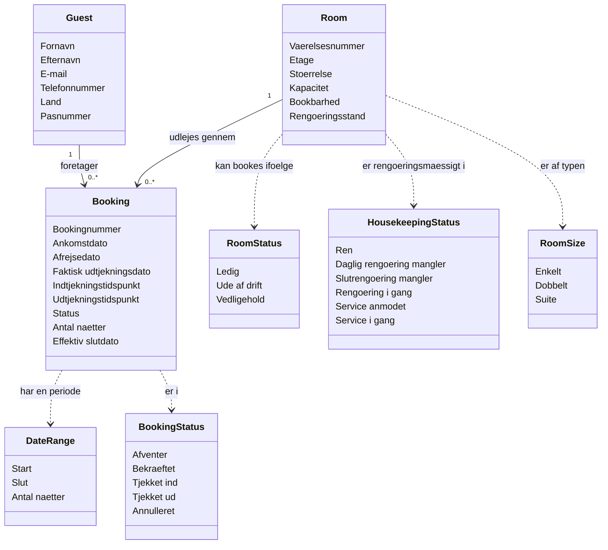

# Domænemodel og objektmodel

> Genereret 2026-09-08 **ud fra den faktiske kode**, ikke fra designdokumenterne.
> Kilder: `src/NFHotel.Domain/`, `src/NFHotel.Application/`, `src/NFHotel.Infrastructure/`, `src/NFHotel.Web/`.
>
> To modeller med hvert sit formål:
> - **Domænemodellen** beskriver forretningens begreber. Den kunne diskuteres med en hotelchef.
> - **Objektmodellen** beskriver koden. Den viser klasser, interfaces og afhængighedsretning på tværs af lagene.

---

# 1. Domænemodel

Begreber, egenskaber og relationer — uden teknik. Ingen repositories, ingen DTO'er, ingen metoder der kun findes af hensyn til implementeringen.

### 1.1 Begreber

| Begreb | Betydning i forretningen |
|---|---|
| **Booking** | En aftale om at en bestemt gæst har et bestemt værelse i en bestemt periode |
| **Room** | Et fysisk værelse på hotellet. Kan udlejes, og skal rengøres mellem gæster |
| **Guest** | En person der bor eller har boet på hotellet. Ikke en brugerkonto |
| **DateRange** | En periode fra ankomst til afrejse. Halvåben: afrejsedagen tælles ikke med som en nat |
| **Bookingnummer** | Kundevendt identifikation, `FLZ-000123`. Afledt af bookingens id, ikke et selvstændigt felt |
| **Effektiv slutdato** | Den dag værelset reelt bliver ledigt igen. Normalt afrejsedatoen — men ved tidlig udtjekning den faktiske udtjekningsdato |
| **Bookbarhed** (`RoomStatus`) | Om værelset overhovedet må udlejes. Uafhængigt af om det er rent |
| **Rengøringsstand** (`HousekeepingStatus`) | Hvor værelset er i rengøringsforløbet. Uafhængigt af om det må udlejes |

**Hvorfor bookbarhed og rengøringsstand er adskilt:** det gamle system havde ét statusfelt til begge, og det var uenigt med sin egen brugerflade. Et værelse kan udmærket være ledigt til udlejning i morgen *og* mangle rengøring i dag — det er to spørgsmål, ikke ét.

### 1.2 Forretningsregler i modellen

| Regel | Beskrivelse |
|---|---|
| Perioden er halvåben | En gæst der rejser den 5. og en der ankommer den 5. deler ikke værelset. Antal nætter er differencen i dage |
| En booking optager sit værelse | Fra ankomstdato til **effektiv** slutdato — medmindre den er annulleret |
| Annullering er den eneste frigivelse | En udtjekket booking optager stadig værelset, men kun frem til den faktiske udtjekningsdato |
| Bekræftelse er ikke en forudsætning for ankomst | En gæst kan tjekke ind uden at bookingen først er bekræftet — walk-in er en reel situation |
| Annullering sletter ikke | Bookingen får status *annulleret* og bliver liggende. Historikken bevares |
| Rengøringsforløbet spærrer ikke for booking | Kun *bookbarhed* afgør om et værelse kan udlejes |

### 1.3 Bevidst udeladt

| Ikke modelleret | Hvorfor |
|---|---|
| **Pris** | Der findes ingen prismodel. `RoomSize` er en kategori, ikke en takst. Uden den kan omsætning ikke beregnes |
| **Bruger og rolle** | Autentificering er udskudt. Systemet har i dag ingen forestilling om hvem der udfører en handling |
| **Betaling og faktura** | Følger af prisen. Ikke besluttet endnu |
| **Tillægsydelser** | Morgenmad, parkering og lignende er foreslået, men ikke besluttet |

---

# 2. Objektmodel

Den faktiske klassestruktur. Pilene peger den vej afhængighederne går — altid indad mod domænet.

```mermaid
classDiagram
    direction LR

    class Booking {
        <<entity>>
        +int BookingId
        +DateOnly StartDate
        +DateOnly EndDate
        +DateOnly? CheckOutDate
        +DateTimeOffset? CheckInTime
        +DateTimeOffset? CheckOutTime
        +BookingStatus Status
        +int RoomId
        +int GuestId
        +DateRange Period
        +DateOnly EffectiveEndDate
        +DateRange EffectivePeriod
        +int NumberOfNights
        +string BookingNumber
        +bool CanConfirm
        +bool CanCheckOut
        +bool CanCancel
        +bool CanReschedule
        +Create(period, roomId, guestId, today)$ Booking
        +CanCheckIn(today) bool
        +Confirm() void
        +CheckIn(occurredAt, today) void
        +CheckOut(occurredAt, checkOutDate, today) void
        +Cancel() void
        +Reschedule(newPeriod, newRoomId, today) void
    }

    class Room {
        <<entity>>
        +int RoomId
        +string RoomNumber
        +int Floor
        +RoomSize Size
        +int Capacity
        +RoomStatus Status
        +HousekeepingStatus HousekeepingStatus
        +bool IsBookable
        +bool CanStartCleaning
        +bool CanCompleteCleaning
        +bool CanStartService
        +Create(roomNumber, floor, size, capacity)$ Room
        +UpdateDetails(roomNumber, floor, size, capacity) void
        +TakeOutOfService() void
        +SendToMaintenance() void
        +ReturnToService() void
        +MarkDailyCleaningDue() void
        +MarkDepartureCleaningDue() void
        +StartCleaning() void
        +CompleteCleaning() void
        +ReportServiceNeeded() void
        +StartService() void
        +CompleteService(requiresCleaning) void
    }

    class Guest {
        <<entity>>
        +int GuestId
        +string FirstName
        +string LastName
        +string Email
        +string PhoneNumber
        +string Country
        +string? PassportNumber
        +string FullName
        +Create(...)$ Guest
        +UpdateDetails(...) void
    }

    class DateRange {
        <<value object>>
        +DateOnly Start
        +DateOnly End
        +int Nights
        +Overlaps(other) bool
        +Contains(date) bool
        +StartsOnOrAfter(today) bool
    }

    class BookingRules {
        <<static>>
        +Overlaps(a, b) bool
        +BlocksRoom(status) bool
        +Conflicts(existing, roomId, period) bool
    }

    class IBookingService {
        <<interface>>
        +GetByIdAsync(id) Result~BookingDetailsDto~
        +GetOverviewAsync(query) Result~List~
        +GetAvailableRoomsAsync(from, to) Result~List~
        +CreateAsync(request) Result~BookingDetailsDto~
        +ConfirmAsync(id) Result~BookingDetailsDto~
        +CheckInAsync(id) Result~BookingDetailsDto~
        +CheckOutAsync(id) Result~BookingDetailsDto~
        +CancelAsync(id) Result~BookingDetailsDto~
        +RescheduleAsync(request) Result~BookingDetailsDto~
    }

    class IRoomService {
        <<interface>>
        +GetAllAsync() Result~List~
        +SearchAsync(filter) Result~List~
        +CreateAsync(request) Result~RoomDetailsDto~
        +UpdateAsync(request) Result~RoomDetailsDto~
        +DeleteAsync(id) Result
        +StartCleaningAsync(id) Result~RoomDetailsDto~
        +CompleteCleaningAsync(id) Result~RoomDetailsDto~
        +ReportServiceNeededAsync(id) Result~RoomDetailsDto~
    }

    class IGuestService {
        <<interface>>
        +GetByIdAsync(id) Result~GuestDetailsDto~
        +SearchAsync(text) Result~List~
        +CreateAsync(request) Result~GuestDetailsDto~
        +UpdateAsync(request) Result~GuestDetailsDto~
        +DeleteAsync(id) Result
        +ValidateFields(fields) Result
    }

    class BookingService {
        <<service>>
    }
    class RoomService {
        <<service>>
    }
    class GuestService {
        <<service>>
    }

    class IBookingRepository {
        <<interface>>
    }
    class IRoomRepository {
        <<interface>>
    }
    class IGuestRepository {
        <<interface>>
    }
    class IUnitOfWork {
        <<interface>>
        +SaveChangesAsync() Task
    }
    class IClock {
        <<interface>>
        +DateTimeOffset UtcNow
        +DateOnly Today
    }

    class BookingRepository {
        <<repository>>
    }
    class RoomRepository {
        <<repository>>
    }
    class GuestRepository {
        <<repository>>
    }
    class HotelDbContext {
        <<DbContext>>
    }
    class SystemClock
    class AesGcmStringEncryptor

    class BookingFlowViewModel {
        <<viewmodel>>
    }
    class BookingListViewModel {
        <<viewmodel>>
    }
    class RoomListViewModel {
        <<viewmodel>>
    }

    BookingService ..|> IBookingService
    RoomService ..|> IRoomService
    GuestService ..|> IGuestService

    BookingService --> IBookingRepository
    BookingService --> IRoomRepository
    BookingService --> IGuestRepository
    BookingService --> IUnitOfWork
    BookingService --> IClock
    RoomService --> IRoomRepository
    GuestService --> IGuestRepository

    BookingService ..> Booking : styrer livscyklus
    BookingService ..> BookingRules : spoerger om overlap
    RoomService ..> Room
    GuestService ..> Guest

    Booking ..> DateRange
    BookingRules ..> DateRange

    BookingRepository ..|> IBookingRepository
    RoomRepository ..|> IRoomRepository
    GuestRepository ..|> IGuestRepository
    SystemClock ..|> IClock
    BookingRepository --> HotelDbContext
    RoomRepository --> HotelDbContext
    GuestRepository --> HotelDbContext
    HotelDbContext ..> AesGcmStringEncryptor : krypterer pasnummer

    BookingFlowViewModel --> IBookingService
    BookingFlowViewModel --> IGuestService
    BookingListViewModel --> IBookingService
    RoomListViewModel --> IRoomService
```

### 2.1 Hvad hvert lag ejer

| Lag | Indhold | Afhængigheder |
|---|---|---|
| **Domain** | `Booking`, `Room`, `Guest`, `DateRange`, `BookingRules`, `GuestRules`, `RoomRules`, fire enums | **Ingen.** Hverken projektreferencer eller NuGet-pakker |
| **Application** | De tre service-interfaces og deres implementeringer, repository-interfaces, `IUnitOfWork`, `IClock`, DTO'er, `Result`, `ErrorCodes` | Kun Domain |
| **Infrastructure** | `HotelDbContext`, entity-konfigurationer, migrationer, tre repositories, `UnitOfWork`, `SystemClock`, `AesGcmStringEncryptor` | Application → Domain |
| **Web** | Razor-komponenter og én ViewModel pr. skærm, `UseCaseRunner`, `ErrorMessages` | Application og Infrastructure |

Afhængighedsretningen håndhæves af en arkitekturtest, ikke af disciplin: den fejler hvis nogen refererer EF Core fra Application, giver Domain en afhængighed, eller lader en service returnere en entitet i stedet for en DTO.

### 2.2 Web-laget — én View og én ViewModel pr. feature

| Feature | View | ViewModel | Bruger |
|---|---|---|---|
| Forside | `Home.razor` | — | ingen data |
| Kundebooking | `Book.razor` | `BookingFlowViewModel` | `IBookingService`, `IGuestService` |
| Kvittering | `BookingReceipt.razor` | `BookingReceiptViewModel` | `IBookingService` |
| Admin-dashboard | `AdminDashboard.razor` | `AdminDashboardViewModel` | `IBookingService`, `IRoomService` |
| Bookingoversigt | `BookingList.razor` | `BookingListViewModel` + `BookingFormViewModel` | `IBookingService`, `IGuestService`, `IRoomService` |
| Rumoversigt | `RoomList.razor` | `RoomListViewModel` + `RoomFormViewModel` | `IRoomService` |
| Gæsteoversigt | `GuestList.razor` | `GuestListViewModel` | `IGuestService` |
| Omsætning | `SalesOverview.razor` | — | placeholder |

Razor-filerne indeholder markup og simpel binding. Al tilstand og alle servicekald ligger i ViewModel-klassen, som injiceres via constructor og kun kender Application-interfaces — aldrig en repository, aldrig en `DbContext`.

### 2.3 To detaljer værd at bemærke

**`Can*`-properties på entiteterne.** `Booking.CanCancel` og `Room.CanStartCleaning` er ikke bekvemmelighed til UI'et — de er den guard overgangsmetoden selv bruger. Derfor kan brugerfladen tegne knapper efter samme regel som domænet håndhæver, uden at reglen findes to steder.

**`IClock` frem for `DateTime.Now`.** Domænet må ikke kende til "nu". Alle regler der har brug for dagens dato får den som parameter, og `SystemClock` er det eneste sted omregningen til hotellets tidszone sker. Det er også forudsætningen for at tilstandsmaskinen kan testes deterministisk.

---

## Forholdet mellem de to modeller

Domænemodellen har ni begreber. Objektmodellen har de samme ni — plus alt det der skal til for at få dem ind og ud af en database og op på en skærm.

Det er sådan det skal se ud: kommer der et begreb i objektmodellen som ikke findes i domænemodellen, er der enten opstået forretningslogik i et teknisk lag, eller også mangler forretningen et ord for noget den faktisk gør.
